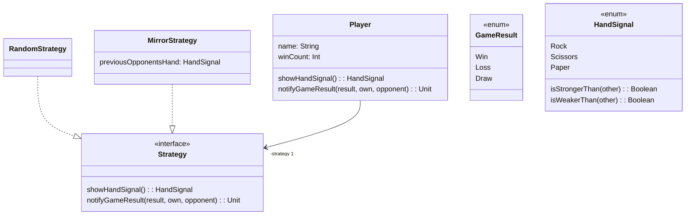

# Exercise #12 - Exam, CI, UML

## 0. Homework questions

**Goal:** Reflect on homework.

1. Is there anything your tutor wants to tell you about previous homework?
2. Do you have any homework-related questions?
3. Do you know that Homework #11 is the last homework?
4. Have you accepted Homework #11 already?

## 1. Example exam

Try out the example exam in `Probeklausur.pdf`.

> [!Note]
> This is just a _preview_ of the exam, the actual exam will have more questions!
> For reference: last year, the exam (worth 100 points in total) consisted of 5 open questions (worth 50 points in total) and 40 multiple choice questions (worth 50 points in total).

For grading multiple choice questions, we use a system based on the following academic paper: [Frandsen, G. S. & Schwartzbach, M. I. (2006). A singular choice for multiple choice S I G C S E Bulletin Inroads, 38 (4), 34-38. ](https://dl.acm.org/doi/pdf/10.1145/1189136.1189164)

## 2. CI

### Creating a new GitHub repository

First, create your own GitHub repository by clicking the ➕ icon in the top-right corner.
You'll need to provide:
- a _name_ for the repository (GitHub also suggests a name in green-colored text)
- a _description_ of the repository
- and choose if the repository is supposed to be public (for everybody to see) or private (only visible to contributors)

1. What is the URL address of the repository?
2. Initialize the repository using the commands provided by GitHub
3. Go to `Settings > Collaborators and Teams` and invite the person sitting next to you to your repository

### Integrating continuously

Find out what "Continuous Integration" (CI) means and why is it useful.

Continuous integration (CI) is a software practice that requires frequently committing code to a shared repository. Committing code more often detects errors sooner and reduces the amount of code a developer needs to debug when finding the source of an error. Frequent code updates also make it easier to merge changes from different members of a software development team. This is great for developers, who can spend more time writing code and less time debugging errors or resolving merge conflicts.

When you commit code to your repository, you can continuously build and test the code to make sure that the commit doesn't introduce errors. Your tests can include code linters (which check style formatting), security checks, code coverage, functional tests, and other custom checks.
 
_Source: https://docs.github.com/en/actions/automating-builds-and-tests/about-continuous-integration#about-continuous-integration_

On GitHub, CI workflows are described in the `.github/workflows` folder.

Navigate to the source for the CI workflow in your repository for Homework 5 and figure out which part does what:
1. Which part of the workflow specifies when the workflow should be run?
2. Which part of the workflow specifies the steps of the workflow?
3. What do the individual steps of this particular workflow do?

### CI and me

In the repository you created, set-up a "Hello, world!" project in your favourite programming language.
- If you're short on time or your favourite language is Scala, you can reuse the structure from the [`se-tuebingen-exercises/helloworld`](https://github.com/se-tuebingen-exercises/helloworld) repository
- If you already have a repository with some code in your account, you can use it instead!

In the repository:
1. go to the `Actions` tab
2. examine the suggested workflows,
3. pick the relevant one for your programming language,
4. configure it and commit it,
5. run it!

> [!Note]
> There are other CI providers than GitHub: other `git`-hosting services like GitLab offer CI
> and there are also separate CI providers like Jenkins and TeamCity you can run in the cloud or your own server.
>
> Also, be advised that GitHub offers GitHub Actions (their CI product):
> - for free for public repositories
> - 2000 CI minutes/month for a user for their private repositories for free (you can pay for more CI minutes or use your own server) 

**We highly recommend you to use CI both in the upcoming Teamprojekt and in your own projects!**
- You can also use CI for automatic [releases](https://github.com/effekt-lang/effekt/blob/master/.github/workflows/deploy.yml#L50): every time all your tests succeed, you can set-up the CI package your software for all platforms so that your users can directly run your software without having to build it!
- You can also use CI for automatic [benchmarking](https://github.com/benchmark-action/github-action-benchmark/blob/master/.github/workflows/java.yml) to get a report of how fast your software is on every push to `main`.
- You can also use CI for automatic deployment: every time your tests succeed, you put the resulting webapp onto the internet; we use that for the lecture notes. :)

## 3. UML

Revisit the lecture slides on UML. Try to briefly recap the following concepts with your neighbour:

### Objects and classes in UML 

1. How are they drawn?
2. What is the relationship between objects and classes?
 
### Relations between classes in UML

1. What are the different kinds of relations?
2. How do they differ?
3. How are they drawn?
 

 

### From UML to Code

Let us assume the following diagram in UML:

Try to answer the following questions:
1. What business logic (of what program) does this diagram describe?
2. What are the classes in this diagram?
3. What are the relations between the classes in this diagram?

Then convert the design of the diagram into Scala (you can use the `Game.scala` file in this repository).
Be aware that there are multiple valid implementations of the same diagram.

**You do not need to implement the game fully.**

Don't actually implement the methods -- first just write signatures and use Scala's `???` (like `...` in Racket) to crash the program if a method is executed.
